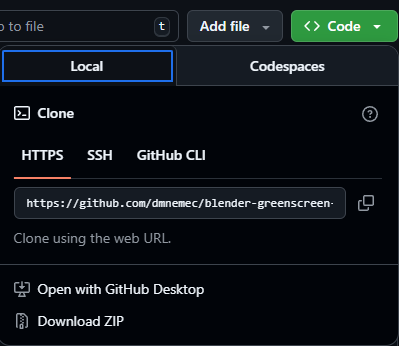
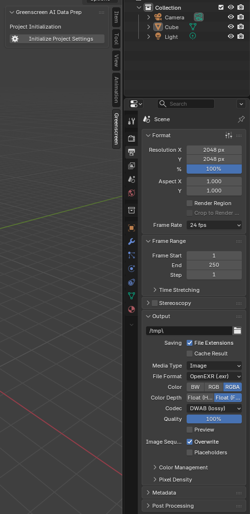

This is the readme

Link to project desc: https://docs.google.com/presentation/d/14evcQveaBUbKgjKsJAda0qK-wqG83thyFcIXHKjIDF8/edit?slide=id.p#slide=id.p

# installation instructions

1. Download this as a .zip



2. install the zip as a plugin in Blender via 

```Edit > Preferences > Add-Ons > Install From Disk (top-right arrow)```

3. Select the downloaded .zip file. 

4. On the Layout screen, you will now have a Greenscreen window.

